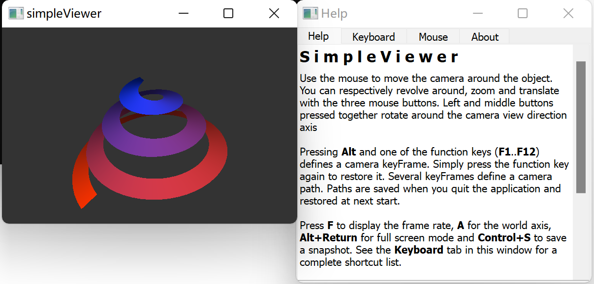
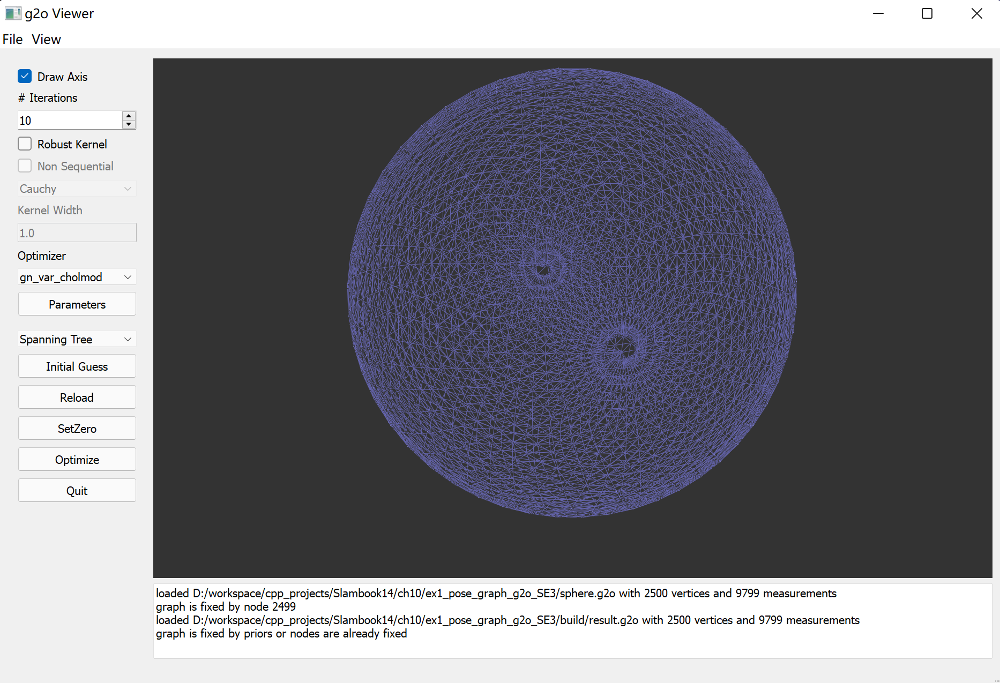

# 依赖库版本说明

本项目使用的第三方库版本如下（截止到：2026年5月8日）。

---

## 核心依赖

- **Eigen**：3.4.0  
- **Ceres Solver**：2.2.0  
- **Sophus**：1.24.6  
- **g2o**：1.0.0  

---

## 说明

- **Eigen**  
  用于矩阵运算与线性代数计算，是整个优化与几何计算的基础库。

  由于我们用的MINGW, 记得加上
  
  ```cmake
  if(MSVC OR (MINGW AND CMAKE_CXX_COMPILER_ID STREQUAL "GNU"))
    # 对于 MinGW/GCC，添加更好的调试符号和内联优化
    # add_compile_options(-O2 -g -finline-functions -fno-inline-small-functions)
    add_compile_options(-O2)
    # 如果仍有问题，尝试降低优化级别
    # add_compile_options(-O1)
  endif()
  ```

- **Ceres Solver**  
  用于非线性优化（如 PnP、BA、ICP 等问题）。
  make的时候关掉CUDA
  ```cmake
  cmake .. -G "MinGW Makefiles" -DCMAKE_BUILD_TYPE=Release -DCMAKE_INSTALL_PREFIX=D:/Software/msys64/ucrt64 -DBUILD_TESTING=OFF -DUSE_CUDA=OFF
  ```

- **Sophus**  
  用于李群表示（SE(3)、SO(3)），便于位姿更新与指数映射。


- **g2o**  
  用于图优化（Graph Optimization），主要用于 BA 等结构化优化问题。

  为了应用g2o::LinearSolverCSparse, 我们需要在G2O里面支持CSPARSE. 具体用法见ch9_ex2

1. 先安装suitesparse这个库
```
pacman -S mingw-w64-ucrt-x86_64-suitesparse
```
2. 再编译G2O带上`-DG2O_USE_CSPARSE=ON`
```cmake
 cmake .. -G "MinGW Makefiles" -DCMAKE_INSTALL_PREFIX=/ucrt64 -DCMAKE_BUILD_TYPE=Release -DG2O_BUILD_APPS=ON -DG2O_BUILD_EXAMPLES=OFF -DG2O_USE_CSPARSE=ON -DCSPARSE_INCLUDE_DIR=/ucrt64/include/suitesparse -DCSPARSE_LIBRARY=/ucrt64/lib/libcxsparse.dll.a -DCMAKE_CXX_FLAGS="-I/ucrt64/include/suitesparse" -DCMAKE_C_FLAGS="-I/ucrt64/include/suitesparse"

```

3. 如果需要g2o_viewer, 我们需要先编译这个libQGLViewer这个库
```
git clone https://github.com/GillesDebunne/libQGLViewer.git
cd libQGLViewer
# 1. 先编译核心库 QGLViewer
cd /d/Software/libQGLViewer/QGLViewer

# 2. 清理之前的编译残留（如果有）
make clean

# 3. 生成 Makefile 并编译核心库
qmake PREFIX=/ucrt64
make -j32

# 4. 手动安装
# QGLViewer没有make install, 需要自己手动复制
# 查看当前目录下生成的库文件
ls -la *.dll *.a 2>/dev/null

# 查看是否已经安装到 /ucrt64 目录
ls -la /ucrt64/lib/libQGLViewer* 2>/dev/null
ls -la /ucrt64/bin/libQGLViewer* 2>/dev/null

# 如果库文件只存在于当前目录而没有安装到系统目录，需要手动复制：
# 手动复制库文件到系统目录
cp -v libQGLViewer3.dll /ucrt64/bin/
cp -v libQGLViewer3.a /ucrt64/lib/
cp -v libQGLViewerd3.dll /ucrt64/bin/
cp -v libQGLViewerd3.a /ucrt64/lib/

# 复制头文件
cp -rv ../QGLViewer /ucrt64/include/

# 确认文件已复制成功
ls -la /ucrt64/bin/libQGLViewer*.dll
ls -la /ucrt64/lib/libQGLViewer*.a
ls -la /ucrt64/include/QGLViewer/
```

然后我们可以编译一下它自带的simpleViewer, 如果发现它用的QGLViewer2, 手动改为QGLViewer3

```
cd /d/Software/libQGLViewer/examples
cp simpleViewer.pro simpleViewer.pro.bak

sed -i 's/QGLViewer2/QGLViewer3/g' examples.pri

# 返回重新编译
cd simpleViewer
make clean
qmake
make -j32
# 生成D:\Software\libQGLViewer\examples\simpleViewer\release\simpleViewer.exe
```
界面长这样:


4. 再编译G2O, `-DG2O_BUILD_APPS=ON`
```cmake
cmake .. -G "MinGW Makefiles" -DCMAKE_INSTALL_PREFIX=/ucrt64 -DCMAKE_BUILD_TYPE=Release -DG2O_BUILD_APPS=ON -DG2O_BUILD_EXAMPLES=OFF -DG2O_USE_CSPARSE=ON -DCSPARSE_INCLUDE_DIR=/ucrt64/include/suitesparse -DCSPARSE_LIBRARY=/ucrt64/lib/libcxsparse.dll.a -DQGLVIEWER_INCLUDE_DIR=/ucrt64/include -DQGLVIEWER_LIBRARY=/ucrt64/lib/libQGLViewer3.a -DCMAKE_CXX_FLAGS="-I/ucrt64/include/suitesparse" -DCMAKE_C_FLAGS="-I/ucrt64/include/suitesparse"
```

打开g2o_viewer, 让我们加载第10章的位姿图文件, 界面长这样:



如果cmake找不到QGLViewer, 我们尝试下自己写个cmake配置
```
# 1. 创建 QGLViewer 的 CMake 配置文件目录
mkdir -p /ucrt64/lib/cmake/QGLViewer

# 2. 创建配置文件
cat > /ucrt64/lib/cmake/QGLViewer/QGLViewerConfig.cmake << 'EOF'
# QGLViewer configuration for Windows/MSYS2 UCRT64
set(QGLVIEWER_FOUND TRUE)
set(QGLVIEWER_INCLUDE_DIRS /ucrt64/include)
set(QGLVIEWER_LIBRARIES /ucrt64/lib/libQGLViewer3.a)
set(QGLVIEWER_LIBRARY ${QGLVIEWER_LIBRARIES})
set(QGLVIEWER_INCLUDE_DIR ${QGLVIEWER_INCLUDE_DIRS})

# Create imported target
add_library(QGLViewer::QGLViewer UNKNOWN IMPORTED)
set_target_properties(QGLViewer::QGLViewer PROPERTIES
    INTERFACE_INCLUDE_DIRECTORIES "${QGLVIEWER_INCLUDE_DIRS}"
    IMPORTED_LOCATION "${QGLVIEWER_LIBRARIES}"
)

# Also create non-namespaced target for compatibility
add_library(QGLViewer UNKNOWN IMPORTED)
set_target_properties(QGLViewer PROPERTIES
    INTERFACE_INCLUDE_DIRECTORIES "${QGLVIEWER_INCLUDE_DIRS}"
    IMPORTED_LOCATION "${QGLVIEWER_LIBRARIES}"
)
EOF
```


---

## 兼容性说明

以上版本在当前工程环境中经过测试可正常编译运行。

如遇到编译或链接问题，请重点检查以下几点：

- 系统中是否存在多个版本的 Eigen（容易冲突）
- Ceres 与 g2o 是否使用了**同一版本 Eigen 编译**
- MSYS2 / MinGW 环境下是否混用了不同工具链（UCRT64 / MINGW64）
- 是否存在系统自带库与手动编译库冲突

---

## 构建环境

- Windows 11  
- MSYS2（UCRT64 或 MINGW64）  
- GCC / MinGW-w64 工具链  
- CMake ≥ 3.15  
- IDE：VS Code  

---

## 参考资料

Windows 上使用 MSYS2 + VSCode + MinGW 的配置方法可参考：

👉 https://www.bilibili.com/video/BV1L94y1N7e6